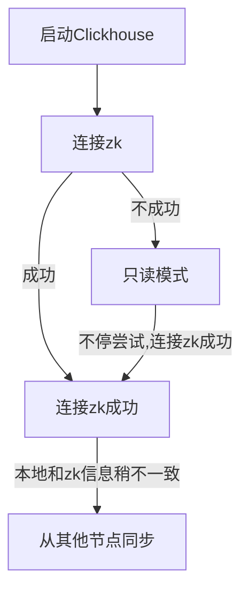
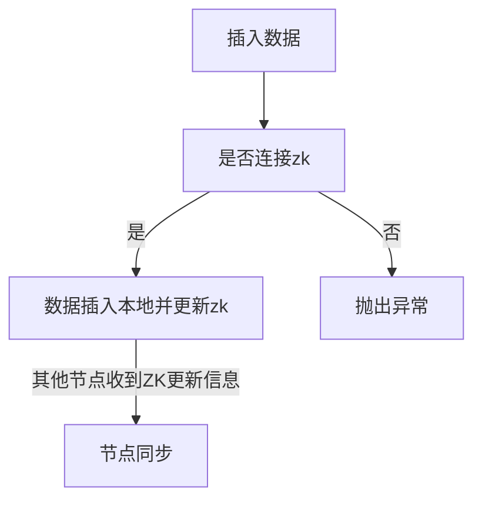

# 目录结构
1.  本地Local表
    * 本地目录
    
    
    >目录结构1992_1808_2672_3
    
    1992是partition key
    1808是指最小块序号
    2672指最大序号
    3指LSM树的层次
    
    > file组成

    checksums.txt 指校验和
    columns.txt 保存数据列的列名和数据类型。
    count.txt 存储该分区的数据总数。
    .bin和.mrk2文件保存数据信息。bin文件存储了真正的列的值（内部又设计列的压缩），mrk文件记录了Mark numbers对应这个列的offset。
    primary.idx pk的稀疏索引信息
    
    
    > 检索
   
    1.  建表时index_granularity这个参数规定了数据按照索引规定排序以后，间隔多少行会建立一个索引的Marks，即索引值
    2.  稀疏索引的意义即是Clickhouse不对所以的列都建立索引（相比较Mysql的B树索引会为每行都建立），而是间隔index_granularity列才建立一个。
    3.  Marks与Marks number均被保存在内存中，利于查询的时候快速检索。
    4.  上图的结构，比如要查询（e，1），会命中marks number=3的记录，根据marks number去寻找需求结果列的mrk文件，得到具体记录的在列bin文件中offset。需要扫描{index_granularity}行的数据。 如果（a，3）最多需要扫描2*{index_granularity}


    
 
2.  Replica表
    * 本地目录
    
    和Local表一致
    * zk目录
    
    1.  Replica表需指定zk路径/clickhouse/tables/{**shard**}/**tablename**和replica参数
    
```
CREATE TABLE lineorder_policy on cluster cluster_two_shards
(
    LO_ORDERKEY             UInt32,
    LO_LINENUMBER           UInt8,
    LO_CUSTKEY              UInt32,
    LO_PARTKEY              UInt32,
    LO_SUPPKEY              UInt32,
    LO_ORDERDATE            Date,
    LO_ORDERPRIORITY  LowCardinality(String),
    LO_SHIPPRIORITY         UInt8,
    LO_QUANTITY             UInt8,
    LO_EXTENDEDPRICE        UInt32,
    LO_ORDTOTALPRICE        UInt32,
    LO_DISCOUNT             UInt8,
    LO_REVENUE              UInt32,
    LO_SUPPLYCOST           UInt32,
    LO_TAX                  UInt8,
    LO_COMMITDATE           Date,
    LO_SHIPMODE             LowCardinality(String)
)
ENGINE = ReplicatedMergeTree('/clickhouse/tables/{shard}/lineorder_policy', '{replica}') PARTITION BY toYear(LO_ORDERDATE) ORDER BY (LO_ORDERDATE, LO_ORDERKEY) SETTINGS storage_policy = 'hdd_round_robin';
```


****

*  更新流程

    
    


    
3.  Distribute表
   * 本地目录
 
 目录存的是底层表的连接方式
 
   * 配置config.xml
   
   类似路由表
   * 查询
        1.  shard之间可以并行查询加速
        2.  shard里的replica可以丢失，但至少需要一个。
        3.  会短暂多次连接丢失的shard的所有replica
   * 插入
        1.  每个shard只选择一个replica插入
        2.  internal_replication参数决定插入程序控制复制，还是底层的replica表内部机制控制复制
        3.  可以使用weight参数控制shard分配比例


